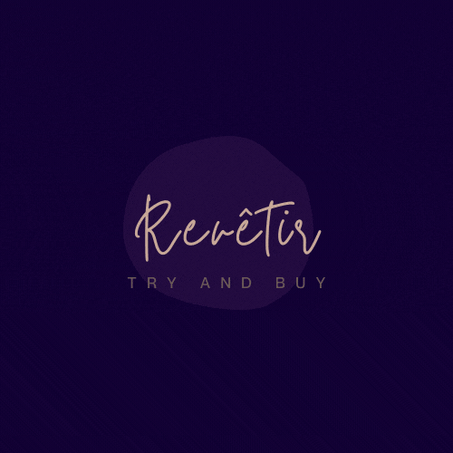

# REVETIR : Try & Buy Clothes

 

The main focus of this project is to enhance the user experience by enabling users to interact with the product which they are buying. To facilitate this, we worked on a deep learning framework, which enables the user to upload his/her own pictures and virtually try the products to understand its fit and look. This will enable the user to become its own model on one hand increasing the user experience also on the other hand increasing the confidence level in himself/herself.

We integrate this project with a complete workflow from product listing, to virtual try on and buying, in order to demonstrate that such an implementation is extremely efficient and has huge potential to become mainstream. The whole product has been adhered to ASGI interface to overcome scalability issues, and get optimized runtimes. The project covers all aspects of database management, frontend UI/UX, backend optimization and much more.

### DATASET

 - **Zalando Dataset**: VITON contains a training set of 14, 221 image pairs and a testing set of 2, 032 image  pairs, each of which has a front-view woman photo and a  top clothing image with the resolution 256 × 192
 - **MPV (Multi-Pose Virtual try on) dataset** : Recently constructed virtual try-on dataset,  MPV contains 35, 687 / 13, 524 person / clothes images.Multiple images of a person wearing the target clothes from different views

### APPROACH

 **MODEL :**
 Parser-Free Virtual Try-on via Distilling Appearance Flows[1]
 
**STEPS**:

 1. Trained the complete pipeline on Datasets
 2. Used a **modified mask- generation technique** to get fine masks of Clothes.
 3. Earlier the model only worked on white background images. We have added automated background removal using U2-Net [2] to generate a fine person image with White background. 
 
 ### MODEL RESULTS

### DEPLOYMENT

 1. **FastAPI as RestAPI backend** :  FastAPI connects Starlette, Pydantic, OpenAPI, and JSON Schema. Pydantic for data validation Starlette for tooling under the hood.
 2.  **Users database and Products Database are hosted on mongo cloud**: Odmantic is used to access MongoDB
 3. **ReactJS frontend**: Axios is used for making api requests to our fastapi based backend
 
 ### WEBAPP OVERVIEW
 LIST VIEW PAGE

PRODUCT PAGE

UPLOAD YOUR IMAGE 

**

TRY ON RESULTS
**

## REFERENCES
[1] Ge, Yuying et al. "Parser-Free Virtual Try-on via Distilling Appearance Flows". arXiv preprint arXiv:2103.04559. (2021).
[2] Qin, Xuebin et al. "U2-Net: Going deeper with nested U-structure for salient object detection". Pattern Recognition 106. (2020): 107404.
